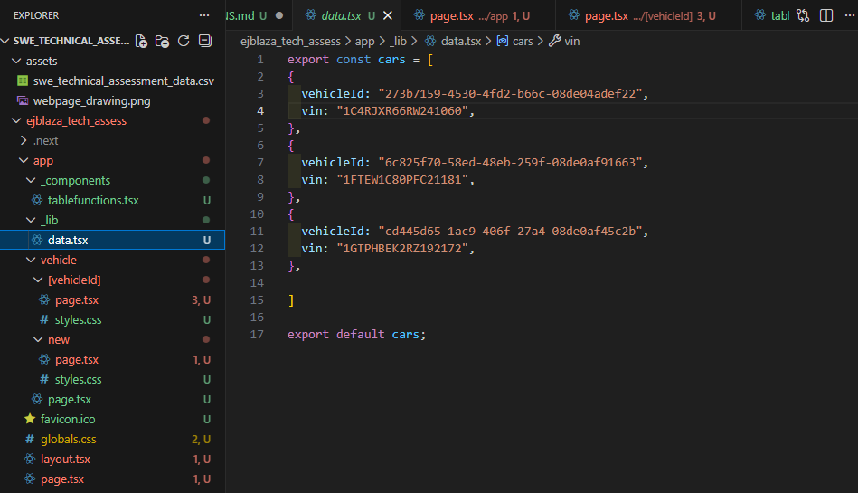
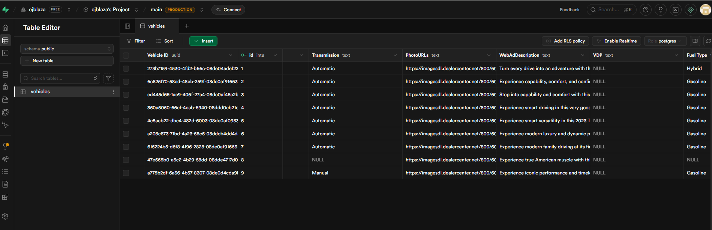

# Tummala Motors - Technical Assessment - Elias Blaza

Preface: I attempted to fulfill the requirements of this assessment with the best of my ability while learning Next.js and Postgres via Supabase. I am unfamiliar handling databases especially merging Postgres to my Next.js project.

---

## Demo Video
* https://www.loom.com/share/a14173aab3c3422c8688206b47d60807
---

## Version Stack

| Technology              | Version          |
| ----------------------- | ---------------- |
| Next.js with TypeScript | 16.0.7           |
| node / npm              | 24.11.1 / 11.6.2 |

Handled with Ubuntu

---

## Set up Project

### 1. Clone Repository

```
git clone git@github.com:ejblaza/swe_technical_assessment.git
```

### 2. Open the project with Visual Studio Code

```
code swe_technical_assessment/
```

Then using the terminal on VS Code, enter the command below to access the Next.js project.

```
cd ejblaza_tech_assess
```

### 3. Ensure to npm is installed on the project

```
# install npm
npm install

# check npm version
npm -v
```

### 4. Boot up project

In the terminal, start up the Next.js server

```
# will run on 'http://localhost:3000/'
npm run dev
```

---

## Accessing the Application

Upon opening the browser with **http://localhost:3000/**:

- Front page introduces the user with the application
  - contains table of vehicles with required information and clickable link to view page of the vehicle's full details and photos
  - contains "Add New Car" button that directs the user to a new page with a form

---

## Problems with project

As mentioned before, I am not familiar with databases and how to merge Postgres with Next.js.

The table in the front page is populated by an Object of "cars" that has sample data of the .csv file.


I found that Supabase can import .csv files and implement it into a readable table and can be used as a database.


I'm sure this can be then accessed to extract the data to populate the vehicle listing page and table list as intended.

## Conclusion

This was definitely a challenge that I did not back down from. I would love to give a better product that's more functional and meets all the requirements. I tried my best to catch up with technology I am unfamiliar with and produce an acceptable product to showcase. The assessment made me eager to learn more and wanting to grow as a developer. I hope I can grow along with the company as well.

Thank you for the opportunity to tackle this challenge, and taking the time to check out my assessment. Hope to hear back from you soon.
